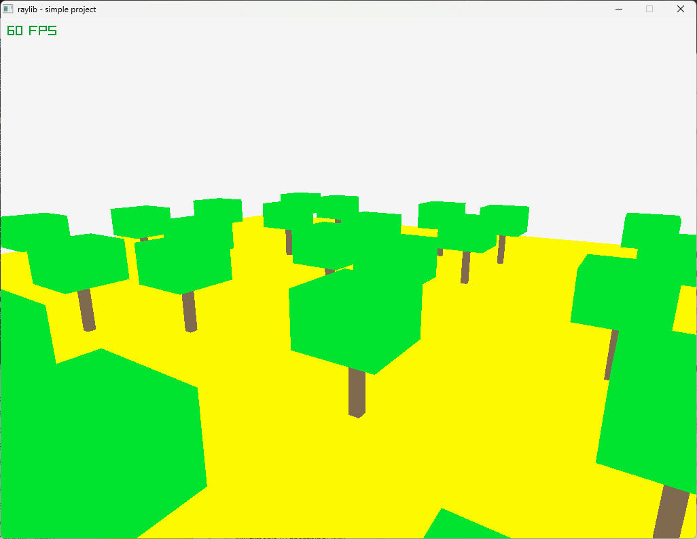

# Trees 2

A simple set of trees on a plane, in Free Pascal with Raylib

Copyright (c) 2024 Pete Goodwin

I used UpdateCameraPro here because I wanted to use arrow keys to control the movement - I'm left handed so it's more convenient.

The trees are randomly located for a more realistic look 8)

